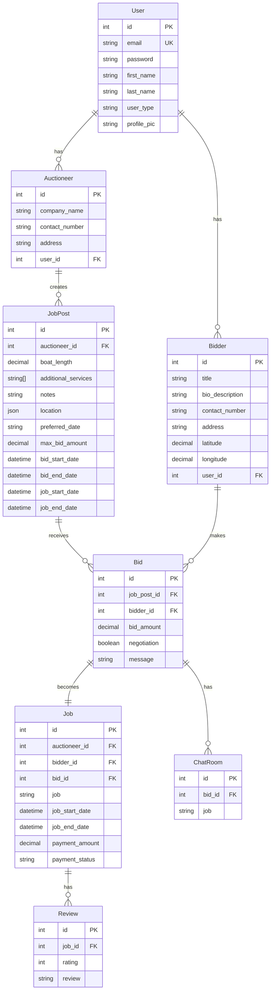

# MarineShine - Boat Cleaning Service Platform

A NestJS-based backend service for connecting boat owners with cleaning service providers through an auction-based system.

## System Architecture

### Entity Relationship Diagram


## Database Schema

### Tables

1. `users`
   - Primary key: `id`
   - Unique key: `email`
   - Fields: `first_name`, `last_name`, `password`, `user_type`, `profile_pic`

2. `auctioneers`
   - Primary key: `id`
   - Foreign key: `user_id` references `users(id)`
   - Fields: `company_name`, `contact_number`, `address`

3. `bidders`
   - Primary key: `id`
   - Foreign key: `user_id` references `users(id)`
   - Fields: `title`, `bio_description`, `contact_number`, `address`, `latitude`, `longitude`

4. `job_posts`
   - Primary key: `id`
   - Foreign key: `auctioneer_id` references `auctioneers(id)`
   - Fields: `boat_length`, `additional_services`, `notes`, `location`, `preferred_date`, `max_bid_amount`, `bid_start_date`, `bid_end_date`, `job_start_date`, `job_end_date`

5. `bids`
   - Primary key: `id`
   - Foreign keys: 
     - `job_post_id` references `job_posts(id)`
     - `bidder_id` references `bidders(id)`
   - Fields: `bid_amount`, `negotiation`, `message`

6. `jobs`
   - Primary key: `id`
   - Foreign keys:
     - `auctioneer_id` references `auctioneers(id)`
     - `bidder_id` references `bidders(id)`
     - `bid_id` references `bids(id)`
   - Fields: `job`, `job_start_date`, `job_end_date`, `payment_amount`, `payment_status`

7. `reviews`
   - Primary key: `id`
   - Foreign key: `job_id` references `jobs(id)`
   - Fields: `rating`, `review`

8. `chat_rooms`
   - Primary key: `id`
   - Foreign key: `bid_id` references `bids(id)`
   - Fields: `job`

## Technologies Used

### Core Framework
- NestJS v10.2.8 - Progressive Node.js framework
- TypeScript v5.2.2 - Typed JavaScript

### Database
- PostgreSQL - Primary database
- TypeORM v0.3.17 - ORM for database operations

### Authentication & Security
- @nestjs/jwt v10.1.1 - JWT authentication
- @nestjs/passport v10.0.2 - Authentication middleware
- passport v0.6.0 - Authentication
- passport-jwt v4.0.1 - JWT strategy
- passport-local v1.0.0 - Local strategy

### Validation & Transformation
- class-validator v0.14.0 - Input validation
- class-transformer v0.5.1 - Object transformation

### Web Server
- @nestjs/platform-express v10.2.8 - Express integration
- cookie-parser v1.4.6 - Cookie parsing
- express-session v1.17.3 - Session management

### View Engine
- ejs v3.1.9 - Template engine

## API Specifications

### Authentication Endpoints

#### POST /auth/register
Register a new user (auctioneer or bidder)
```typescript
{
  first_name: string;
  last_name: string;
  email: string;
  password: string;
  user_type: 'bidder' | 'auctioneer';
}
```

#### POST /auth/login
Login with credentials
```typescript
{
  email: string;
  password: string;
}
```

### Job Posts Endpoints

#### POST /job-posts
Create a new job post
```typescript
{
  boatLength: number;
  additionalServices: string[];
  notes?: string;
  location?: {
    address: string;
    latitude: number;
    longitude: number;
  };
  preferredDate?: string;
  max_bid_amount?: number;
  bid_start_date?: Date;
  bid_end_date?: Date;
  job_start_date?: Date;
  job_end_date?: Date;
}
```

#### GET /job-posts/nearby
Get nearby job posts with filters
```typescript
Query Parameters:
{
  radius?: number;
  boatLengthFrom?: number;
  boatLengthTo?: number;
  additionalServices?: string;
}
```

### Bids Endpoints

#### POST /bids
Create a new bid
```typescript
{
  jobPostId: number;
  bid_amount: number;
  message?: string;
}
```

### Jobs Endpoints

#### POST /jobs/from-bid
Create a job from a bid
```typescript
{
  bidId: number;
}
```

#### GET /jobs/calendar
Get calendar jobs
```typescript
Query Parameters:
{
  month: number;
  year: number;
}
```

## Setup Instructions

1. Clone the repository
2. Install dependencies:
   ```bash
   npm install
   ```

3. Configure environment variables:
   ```env
   DB_HOST=localhost
   DB_PORT=5432
   DB_USERNAME=postgres
   DB_PASSWORD=postgres
   DB_NAME=auction_db
   JWT_SECRET=your-secret-key
   ```

4. Run migrations:
   ```bash
   npm run typeorm migration:run
   ```

5. Start the development server:
   ```bash
   npm run start:dev
   ```

## Development Guidelines

1. Follow NestJS best practices and modular architecture
2. Use TypeORM decorators for entity definitions
3. Implement proper validation using class-validator
4. Maintain type safety with TypeScript
5. Write comprehensive unit tests
6. Follow RESTful API design principles

## Security Features

1. JWT-based authentication
2. Password hashing using SHA-256
3. Role-based access control
4. Request validation
5. Cookie security with HTTP-only flags
6. CORS protection

## Error Handling

The application uses a standardized error response format:
```typescript
{
  success: boolean;
  message: string;
  error?: {
    code: string;
    details?: string;
  }
}
```

Common error codes:
- UNAUTHORIZED
- NOT_FOUND
- BAD_REQUEST
- INTERNAL_ERROR

## Testing

Run tests using:
```bash
# Unit tests
npm run test

# e2e tests
npm run test:e2e

# Test coverage
npm run test:cov
```