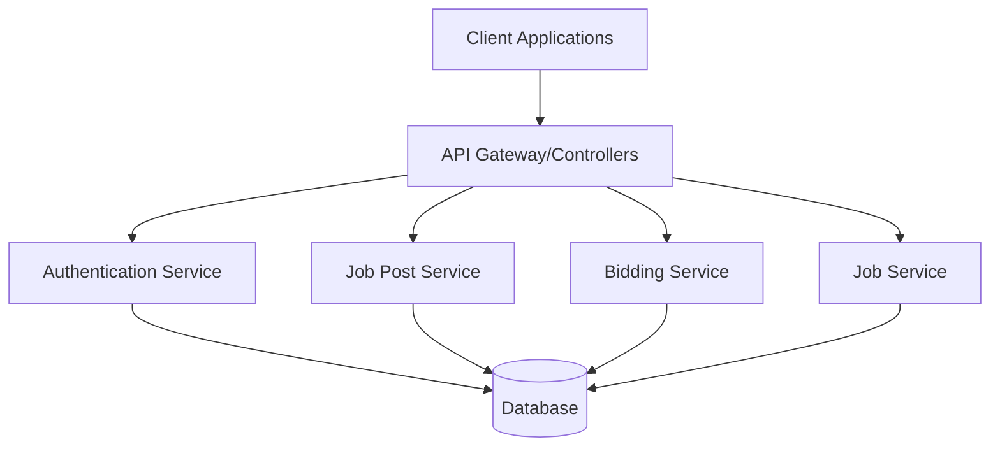
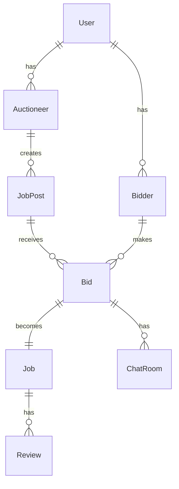

# MarineShine - Technical Documentation

## 1. Project Overview

### Description
MarineShine is a NestJS-based backend service that facilitates connections between boat owners and cleaning service providers through an auction-based system. The platform enables auctioneers (boat owners) to post cleaning jobs and bidders (service providers) to bid on these jobs.

### Core Features
- User authentication and authorization
- Job post management
- Real-time bidding system
- Job management and tracking
- Chat system for negotiation
- Review and rating system
- Location-based job matching
- Calendar integration for job scheduling

## 2. System Architecture

### Architecture Type
- Monolithic NestJS application
- RESTful API design
- PostgreSQL database
- JWT-based authentication
- TypeORM for database operations

### Architecture Diagram


## 3. Database Schema

### Entity Relationship Diagram


### Tables & Relations

#### users
- `id` (PK) UUID
- `email` (UNIQUE) VARCHAR
- `password` VARCHAR
- `first_name` VARCHAR
- `last_name` VARCHAR
- `user_type` ENUM ('admin', 'auctioneer', 'bidder')
- `profile_pic` VARCHAR NULL
- Relations:
  - One-to-Many with `auctioneers`
  - One-to-Many with `bidders`

#### auctioneers
- `id` (PK) UUID
- `user_id` (FK) UUID
- `company_name` VARCHAR
- `contact_number` VARCHAR
- `address` TEXT
- Relations:
  - Many-to-One with `users`
  - One-to-Many with `job_posts`
  - One-to-Many with `jobs`

[Additional tables and relations as in your original file...]

## 4. Technology Stack

### Core Framework & Language
- **Node.js**: v18.x
- **NestJS**: v10.2.8
  - Progressive Node.js framework
  - Built with TypeScript
  - Dependency injection
  - Module-based architecture

- **TypeScript**: v5.2.2
  - Static typing
  - Enhanced IDE support
  - Better code organization

### Database & ORM
- **PostgreSQL**: v14.x
  - Primary database
  - ACID compliance
  - Spatial queries support
  - JSON data type support

- **TypeORM**: v0.3.17
  - Database schema management
  - Migration support
  - Repository pattern
  - Query builder
  - Relationship management

### Authentication & Security
- **@nestjs/jwt**: v10.1.1
  - JWT token generation
  - Token validation
  - Payload encryption

- **@nestjs/passport**: v10.0.2
  - Authentication strategies
  - Guard implementation
  - Session management

[Additional packages and details as in your original file...]

## 5. API Specifications

### Authentication APIs

#### Register User
```http
POST /auth/register
Content-Type: application/json
```

**Request Body:**
```json
{
  "first_name": "string",
  "last_name": "string",
  "email": "string",
  "password": "string",
  "user_type": "bidder | auctioneer"
}
```

**Success Response:**
```json
{
  "success": true,
  "message": "Registration successful",
  "data": {
    "id": "uuid",
    "email": "string",
    "first_name": "string",
    "last_name": "string",
    "user_type": "string"
  }
}
```

[Additional API specifications as in your original file...]

## 6. Security Implementation

### Authentication
- JWT-based token authentication
- Password hashing using SHA-256
- Token expiration and refresh mechanism
- HTTP-only cookies for token storage

### Authorization
- Role-based access control (RBAC)
- Resource ownership validation
- Route guards
- Custom decorators for user types

### Data Protection
- Input validation using class-validator
- Request sanitization
- CORS protection
- Rate limiting
- SQL injection prevention through TypeORM

## 7. Error Handling

### Standard Error Response
```typescript
{
  success: false,
  message: string,
  error: {
    code: string,
    details?: string
  }
}
```

### Error Codes
- `UNAUTHORIZED`: Authentication/authorization failures
- `NOT_FOUND`: Resource not found
- `BAD_REQUEST`: Invalid input/parameters
- `INTERNAL_ERROR`: Server-side errors
- `CONFLICT`: Resource conflicts
- `VALIDATION_ERROR`: Input validation failures

## 8. Development Guidelines

### Code Organization
- Follow NestJS module structure
- Use services for business logic
- Controllers for request handling
- DTOs for data validation
- Interfaces for type definitions
- Utilities for common functions

### Best Practices
1. Use dependency injection
2. Implement proper validation
3. Write comprehensive tests
4. Follow RESTful conventions
5. Document APIs thoroughly
6. Handle errors gracefully
7. Use TypeScript features effectively

### Testing Strategy
- Unit tests for services
- Integration tests for APIs
- E2E tests for critical flows
- Test coverage requirements
- Mock external dependencies

## 9. Deployment

### Requirements
- Node.js v18.x
- PostgreSQL v14.x
- Environment variables configuration
- SSL certificate for HTTPS

### Environment Variables
```env
DB_HOST=localhost
DB_PORT=5432
DB_USERNAME=postgres
DB_PASSWORD=postgres
DB_NAME=auction_db
JWT_SECRET=your-secret-key
```

### Deployment Steps
1. Build TypeScript code
2. Run database migrations
3. Set environment variables
4. Start application server
5. Configure reverse proxy
6. Enable SSL/TLS

## 10. Monitoring & Logging

### Logging
- Request/response logging
- Error logging
- Performance metrics
- Audit trails

### Monitoring
- Server health checks
- Database performance
- API response times
- Error rates
- Resource utilization

## 11. Performance Optimization

### Strategies
1. Database indexing
2. Query optimization
3. Caching implementation
4. Rate limiting
5. Connection pooling
6. Load balancing
7. Asset optimization

### Caching
- Response caching
- Database query caching
- Static asset caching
- Cache invalidation strategies

## 12. Maintenance

### Regular Tasks
1. Database backups
2. Log rotation
3. Security updates
4. Performance monitoring
5. Error tracking
6. User feedback handling

### Documentation
1. API documentation
2. Code documentation
3. Database schema documentation
4. Deployment documentation
5. Troubleshooting guides